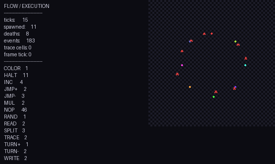

# markovji — :P-Markov



**markovji** es un esolang (lenguaje de programación esotérico) Turing-completo basado en **algoritmos de Markov** con sintaxis **kaomoji** (caritas ASCII).

> "El único dato es `:`. Todo lo demás son caritas." — *Diseño markovji*

---

## 🎯 ¿Qué es?

Un sistema de reescritura tipo Markov donde:
- **`:`** = único átomo computacional (unario)
- **Caritas** (`:P`, `:O`, `:3`, `xD`, `:)`, `:(`, `:D`, ...)= metasintaxis (operadores, variables, control)
- **Reglas** se aplican en orden; la primera que matchea gana; luego se reinicia el escaneo
- **Para** cuando ninguna regla matchea

---

## 📋 Sintaxis

| Kaomoji | Nombre | Rol |
|---------|--------|-----|
| `:` | **punto** | Unidad unaria (dato) |
| `:P` | **inicio** | Punto de entrada del programa |
| `:O` | **wildcard** | Match `:+` (uno o más `:`), vincula a `$O` |
| `:3` | **separador** | Divide LHS `:3` RHS |
| `xD` | **terminador** | Fin de regla |
| `:)` `:(` `:D` `:]` `:[` `;)` | **vars** | Variables `$0`–`$5` (vinculan `:+` greedy) |
| `~` | **emit** | Prefijo en RHS: emite y elimina lo matcheado |
| `jajaja` | **comentario** | Se ignora |

---

## 🚀 Ejecución

```bash
# Archivo
python interpreter.py ejemplos/hola.kaomoji

# Inline
python -c "
from interpreter import run
src = ''':P
:O :3 ~::::: xD
::=
:'''
output, steps, status = run(src)
print(f'{status}: {output}')
"
```

---

## 🧪 Ejemplos

### Hola mundo (emite `:::::` y para)
```kaomoji
jajaja hola mundo
:P
:O :3 ~::::: xD
::=
:
```

### Incremento unario (crece infinito)
```kaomoji
:P
:O :3 :O: xD
::=
:::
```

### Decremento (cuenta hasta vacío)
```kaomoji
:P
:: :3 : xD
: :3  xD
::=
:::::
```

### Copia (duplica el número unario)
```kaomoji
jajaja :) captura la entrada
:P
:) :3 :) :) xD
::=
:::
```

---

## 🧠 ¿Por qué es Turing-completo?

Los algoritmos de Markov sobre alfabeto unario con vinculación de variables (`:O` + `:)`, `:(`) son equivalentes a:
- Sistemas de etiquetas (tag systems)
- Sistemas canónicos de Post
- Máquinas de Minsky (2 contadores)

La combinación **wildcard + variables** da pattern matching + sustitución = reescritura universal.

---

## 📦 Estructura del repo

```
markovji/
├── interpreter.py      # Intérprete completo (~250 líneas)
├── pyproject.toml      # Paquete instalable
├── manifest.json       # Metadatos del engine
├── LICENSE             # MIT
├── ejemplos/           # 7 programas .kaomoji
│   ├── hola.kaomoji
│   ├── incremento.kaomoji
│   ├── decremento.kaomoji
│   ├── copia.kaomoji
│   ├── intercambio.kaomoji
│   ├── reversa.kaomoji
│   └── busy.kaomoji
├── tests/
│   └── test_interpreter.py  # 8 tests pasando
└── markovji.gif        # Visualización FlowGen
```

---

## 🔬 Tests

```bash
python tests/test_interpreter.py
# OK test_hola
# OK test_incremento
# OK test_decremento
# OK test_copia
# OK test_intercambio
# OK test_variable_binding
# OK test_wildcard
# OK test_prioridad_reglas
#
# OK All tests passed!
```

---

## 📜 Licencia

MIT — ver [LICENSE](LICENSE).

---

## 🤝 Créditos

- Diseño espontáneo en chat (Nemotron + humano)
- Sintaxis kaomoji: cultura mexicana de internet `jajaja` `:P` `xD` `:O` `:3`
- Motor: algoritmo de Markov clásico + binding de variables
- Visualización: **FlowGen** (capa sobre FLOW esolang)

> "El zoológico se ve como una convención interna que se salió de control." 🗿